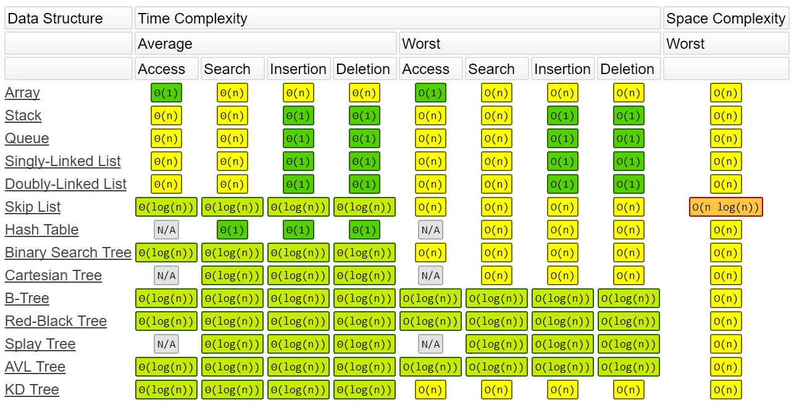

# coding-interview
## Data structure
A data structure is a way to store and organize data in a computer so that it can be used efficiently.

An abstract data type <b>(ADT)</b> is the specification of a data type within some language, independent of an implementation. The interface for the ADT is defined in terms of a type and a set of operations on that type. The behavior of each operation is determined by its inputs and outputs. An ADT does not specify how the data type is implemented. These implementation details are hidden from the user of the ADT and protected from outside access, a concept referred to as encapsulation. A data structure is an implementation for an ADT. 

In simple term, ADT is a definition of data type and operation, but not the implementation.

### The five basic requirements of any ADT,
* How to <b>Access</b> (one item / all item)
* How to <b>Insert</b> (at end / at position)
* How to <b>Delete</b> (from end / from position)
* How to <b>Find</b> (if exists / what location)
* How to <b>Sort</b> (sorr in place / created sorted version)

## Operations, Time complexity, and Space Complexity:





## List:
#### ADT:
A List is a collection of items stored at contiguous memory locations. The idea is to store multiple items of the same type together. i.e Array, string, Linked List.

* get() – Return an element from the list at any given position.
* insert() – Insert an element at any position of the list.
* remove() – Remove the first occurrence of any element from a non-empty list.
* removeAt() – Remove the element at a specified location from a non-empty list.
* replace() – Replace an element at any position by another element.
* size() – Return the number of elements in the list.
* isEmpty() – Return true if the list is empty, otherwise return false.
* isFull() – Return true if the list is full, otherwise return false.

#### Implementation:
* [Array Stack Implementation](array/array_stack_init.c)
* [Array Heap Implementation](array/array_heap_init.c)
* [Array ADT Implementation](array/array_adt_implementation.c)
* String Stack Implementation
* String Heap Implementation
* String ADT Implementation

```bash
List always looks for contiguous memory and return the pointer if successfull. If the size is full we need to double the array and copy old array elements to new array. To overcome this problem we use <b>Linked List</br>.
```

## Linked List
#### ADT:
A linked list is a linear data structure, in which the elements are not stored at contiguous memory locations. The elements in a linked list are linked using pointers.

Linked List is an Abstract Data Type (ADT) that holds a collection of Nodes, the nodes can be accessed in a sequential way.

* prepand(value) - Add Node at the beg
* postpand(vale) - Add Node at the end
* appendAtIndex(position) - Add Node at the Nth Index
* pop() - Remove node at the end
* popFirst() - Remove node at the beg
* popAtIndex(position) - Remove at Nth Index 

#### Implementation:
* [Single Linked List ADT Implementation](linked_list/single_linked_list.c)
* [Reverse a linked list using Iteration]
* [Reverse a linked list using recursion]
* [Double Linked List ADT Implementation]
* [Circular Linked List ADT Implementation]


## Stack
### ADT:
Stack is a linear data structure which follows a particular order in which the operations are performed. The order may be LIFO(Last In First Out) or FILO(First In Last Out).


* isFull(), This is used to check whether stack is full or not
* isEmpry(), This is used to check whether stack is empty or not
* push(x), This is used to push x into the stack
* pop(), This is used to delete one element from top of the stack
* peek(), This is used to get the top most element of the stack
* size(), this function is used to get number of elements present into the stack

### Implementation:
[Single Linked List Stacks ADT Implementation](stacks/stack_linked_list.c)

### Queue
A Queue is a linear structure which follows a particular order in which the operations are performed. The order is First In First Out (FIFO). A good example of a queue is any queue of consumers for a resource where the consumer that came first is served first. The difference between stacks and queues is in removing. In a stack we remove the item the most recently added; in a queue, we remove the item the least recently added.


* enqueue() – Insert an element at the end of the queue.
* dequeue() – Remove and return the first element of the queue, if the * * queue is not empty.
* peek() – Return the element of the queue without removing it, if the * * queue is not empty.
* size() – Return the number of elements in the queue.
* isEmpty() – Return true if the queue is empty, otherwise return false.
* isFull() – Return true if the queue is full, otherwise return false.

### Implementation:
[queue_linked_list](queue/queue_linked_list.c)

## Sorting algorithms


